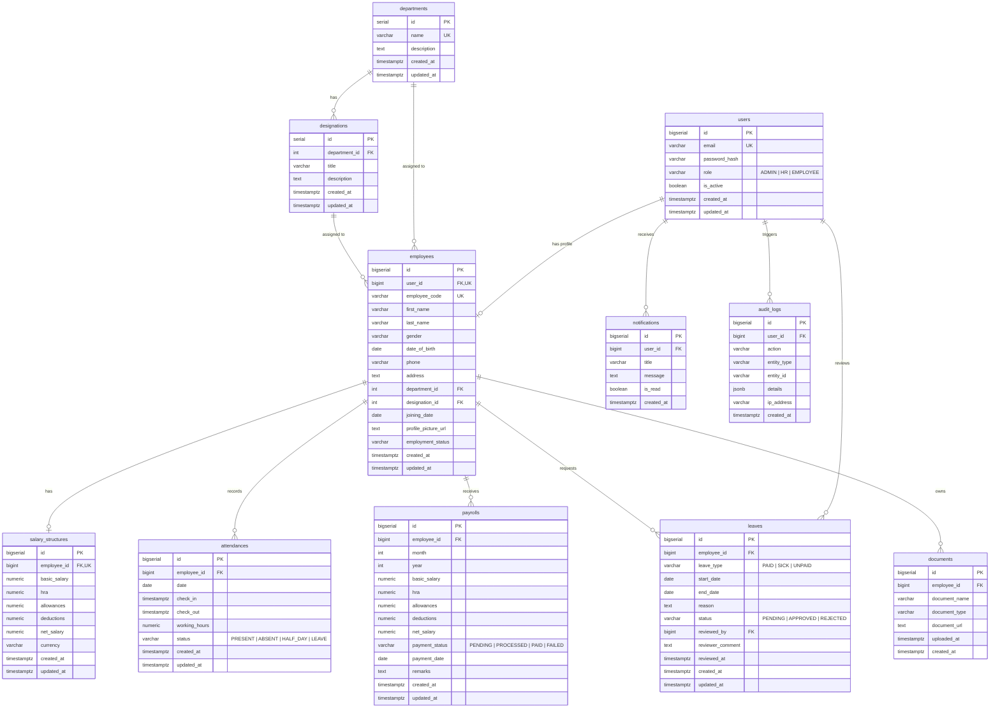

# Dayflow - Human Resource Management System (HRMS)

A modern, normalized, production-grade **PostgreSQL** schema and **Node.js/Express** backend database configuration for the Dayflow HRMS.

---

## 🏛️ Database Architecture & ER Diagram



---

## 👥 Demo Users & Test Accounts

All demo accounts use the standard password: **`Password@123`** *(hashed using bcrypt)*.

| Employee ID | Name | Role | Email | Department | Designation | Monthly Net |
|:---|:---|:---|:---|:---|:---|:---|
| **ADM001** | Priya Menon | `ADMIN` | `priya.menon@dayflow.demo` | Human Resources | HR Manager | ₹95,000 |
| **HR001** | Meera Joshi | `HR` | `meera.joshi@dayflow.demo` | Human Resources | HR Executive | ₹58,000 |
| **EMP001** | Aarav Sharma | `EMPLOYEE` | `aarav@dayflow.demo` | Engineering | Software Engineer | ₹65,000 |
| **EMP002** | Ananya Rao | `EMPLOYEE` | `ananya@dayflow.demo` | Design | UI/UX Designer | ₹58,000 |
| **EMP003** | Rohan Mehta | `EMPLOYEE` | `rohan@dayflow.demo` | Engineering | Backend Developer | ₹72,000 |
| **EMP004** | Diya Nair | `EMPLOYEE` | `diya@dayflow.demo` | Marketing | Marketing Executive | ₹45,000 |
| **EMP005** | Arjun Patel | `EMPLOYEE` | `arjun@dayflow.demo` | Finance | Financial Analyst | ₹55,000 |
| **EMP006** | Sneha Iyer | `EMPLOYEE` | `sneha@dayflow.demo` | Engineering | DevOps Engineer | ₹78,000 |
| **EMP007** | Kabir Singh | `EMPLOYEE` | `kabir@dayflow.demo` | Sales | Sales Executive | ₹42,000 |
| **EMP008** | Kavya Reddy | `EMPLOYEE` | `kavya@dayflow.demo` | Engineering | Frontend Developer | ₹62,000 |
| **EMP009** | Rahul Verma | `EMPLOYEE` | `rahul@dayflow.demo` | Sales | Sales Executive | ₹44,000 |
| **EMP010** | Ishita Kapoor | `EMPLOYEE` | `ishita@dayflow.demo` | Design | Product Designer | ₹60,000 |

---

## 🚀 Setup & Execution Guide

### Option 1: Using `psql` CLI (Recommended)

1. Open your terminal or PowerShell in the root directory:
   ```bash
   # Connect to your existing PostgreSQL database "dayflow"
   psql -U postgres -d dayflow -f schema.sql

   # Seed the database with demo records
   psql -U postgres -d dayflow -f seed.sql
   ```

2. Alternatively, inside an active `psql` session:
   ```sql
   \c dayflow
   \i schema.sql
   \i seed.sql
   ```

---

### Option 2: Using Node.js Database Scripts

1. Navigate to the backend directory and install dependencies:
   ```bash
   cd backend
   npm install
   ```

2. Configure your `.env` (already pre-filled for `localhost:5432` / database `dayflow`):
   ```env
   PORT=5000
   DB_HOST=localhost
   DB_PORT=5432
   DB_NAME=dayflow
   DB_USER=postgres
   DB_PASSWORD=postgres
   ```

3. Run migrations and seed data via npm scripts:
   ```bash
   # Run schema migration
   npm run db:migrate

   # Run seed script
   npm run db:seed

   # Or run both together:
   npm run db:setup
   ```

4. Start the backend development server:
   ```bash
   npm run dev
   ```
   - Healthcheck: `http://localhost:5000/api/health`
   - HRMS Stats: `http://localhost:5000/api/stats`

---

## 🔍 Verification SQL Queries

Run these queries in `psql` to verify the seeded records:

```sql
-- 1. Table Record Counts
SELECT 'users' AS table_name, COUNT(*) FROM users
UNION ALL SELECT 'departments', COUNT(*) FROM departments
UNION ALL SELECT 'designations', COUNT(*) FROM designations
UNION ALL SELECT 'employees', COUNT(*) FROM employees
UNION ALL SELECT 'salary_structures', COUNT(*) FROM salary_structures
UNION ALL SELECT 'attendances', COUNT(*) FROM attendances
UNION ALL SELECT 'leaves', COUNT(*) FROM leaves
UNION ALL SELECT 'payrolls', COUNT(*) FROM payrolls
UNION ALL SELECT 'documents', COUNT(*) FROM documents
UNION ALL SELECT 'notifications', COUNT(*) FROM notifications
UNION ALL SELECT 'audit_logs', COUNT(*) FROM audit_logs;

-- 2. Check Employee Profiles with Department & Designation
SELECT 
    e.employee_code,
    e.first_name || ' ' || e.last_name AS employee_name,
    u.role,
    d.name AS department,
    ds.title AS designation,
    s.net_salary
FROM employees e
JOIN users u ON e.user_id = u.id
JOIN departments d ON e.department_id = d.id
JOIN designations ds ON e.designation_id = ds.id
JOIN salary_structures s ON e.id = s.employee_id
ORDER BY e.id;

-- 3. Check Leave Request Status Distribution
SELECT status, leave_type, COUNT(*) 
FROM leaves 
GROUP BY status, leave_type 
ORDER BY status;

-- 4. Check Payroll Disbursement by Status
SELECT payment_status, month, year, COUNT(*), SUM(net_salary) AS total_payout
FROM payrolls
GROUP BY payment_status, month, year
ORDER BY year DESC, month DESC;
```

---

## 🔌 Complete REST API Reference

### 🔐 Authentication (`/api/auth`)
- `POST /api/auth/register` — Register a new account (`email`, `password`, `employee_code`, `first_name`, `last_name`, `role`).
- `POST /api/auth/login` — Sign in with email & password $\rightarrow$ returns JWT token & user profile.
- `GET /api/auth/me` — *(Auth)* Get currently authenticated user and employee profile.
- `POST /api/auth/verify-email` — *(Auth)* Mark email as verified.

### 📊 Dashboards (`/api/dashboard`)
- `GET /api/dashboard/employee` — *(Auth)* Employee view: today's check-in status, attendance metrics, recent leaves, latest payslip, unread alerts, recent activities.
- `GET /api/dashboard/admin` — *(Admin/HR)* Organization view: total active headcount, departments, today's attendance summary, pending leave requests, recent system audit feed.

### 👤 Employees (`/api/employees`)
- `GET /api/employees` — *(Admin/HR)* List all employees with filters (`department_id`, `status`, `search`).
- `GET /api/employees/:id` — *(Auth)* Get single employee details, job info, salary structure, and uploaded documents.
- `PUT /api/employees/me` — *(Auth)* Employee update restricted profile fields (`phone`, `address`, `profile_picture_url`).
- `PUT /api/employees/:id` — *(Admin/HR)* Admin/HR update all employee details & base compensation.

### ⏱️ Attendance (`/api/attendance`)
- `POST /api/attendance/check-in` — *(Auth)* Check-in for current employee today.
- `POST /api/attendance/check-out` — *(Auth)* Check-out for current employee today (calculates hours & status).
- `GET /api/attendance/my` — *(Auth)* View own attendance history (query params: `view=daily|weekly`, `start_date`, `end_date`).
- `GET /api/attendance/all` — *(Admin/HR)* View attendance records across all employees with filters.
- `PUT /api/attendance/:id` — *(Admin/HR)* Regularize or update an attendance record.

### 🌴 Leave / Time-off (`/api/leaves`)
- `POST /api/leaves` — *(Auth)* Apply for leave (`leave_type`: `PAID`, `SICK`, `UNPAID`, `start_date`, `end_date`, `reason`).
- `GET /api/leaves/my` — *(Auth)* Get own leave requests and status history.
- `GET /api/leaves` — *(Admin/HR)* View all leave requests with filters (`status`: `PENDING`, `APPROVED`, `REJECTED`).
- `PUT /api/leaves/:id/review` — *(Admin/HR)* Approve or reject a leave request with `reviewer_comment` *(auto-updates attendance records and sends employee alert)*.

### 💰 Payroll & Salary (`/api/payroll`)
- `GET /api/payroll/my` — *(Auth)* Employee view own monthly payslips *(READ-ONLY)*.
- `GET /api/payroll/my/structure` — *(Auth)* Employee view own base salary structure *(READ-ONLY)*.
- `GET /api/payroll` — *(Admin/HR)* View company-wide payroll records.
- `PUT /api/payroll/structure/:employeeId` — *(Admin)* Update base compensation package.
- `POST /api/payroll/process-batch` — *(Admin)* Process monthly payroll calculation batch for all active employees.
- `PUT /api/payroll/:id/status` — *(Admin)* Update disbursement status (`PENDING`, `PROCESSED`, `PAID`, `FAILED`).

### 📁 Documents (`/api/documents`)
- `GET /api/documents/my` — *(Auth)* Get own profile documents.
- `GET /api/documents/employee/:employeeId` — *(Admin/HR)* Get documents for a specific employee.
- `POST /api/documents` — *(Auth)* Add/upload a document record (`document_name`, `document_type`, `document_url`).
- `DELETE /api/documents/:id` — *(Auth)* Remove a document record.

### 🔔 Notifications (`/api/notifications`)
- `GET /api/notifications` — *(Auth)* Get all in-app notifications (query: `unread_only=true`).
- `PUT /api/notifications/:id/read` — *(Auth)* Mark single notification as read.
- `PUT /api/notifications/mark-all-read` — *(Auth)* Mark all notifications as read.

### 📜 Audit Logs & Organizations (`/api/audit-logs`, `/api/departments`)
- `GET /api/audit-logs` — *(Admin/HR)* View audit and activity logs.
- `GET /api/departments` — *(Auth)* List departments and active employee counts.
- `GET /api/departments/designations` — *(Auth)* List job designations by department.

---

## 🧪 Automated API Testing

Run the automated backend test suite:
```bash
cd backend
npm run test:api
```
*(Runs 14 automated end-to-end endpoint tests verifying Auth, RBAC, Dashboards, Profiles, Attendance, Leaves, Payroll, Documents, and Notifications).*